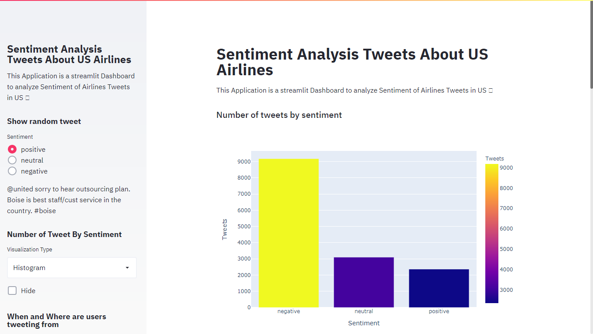
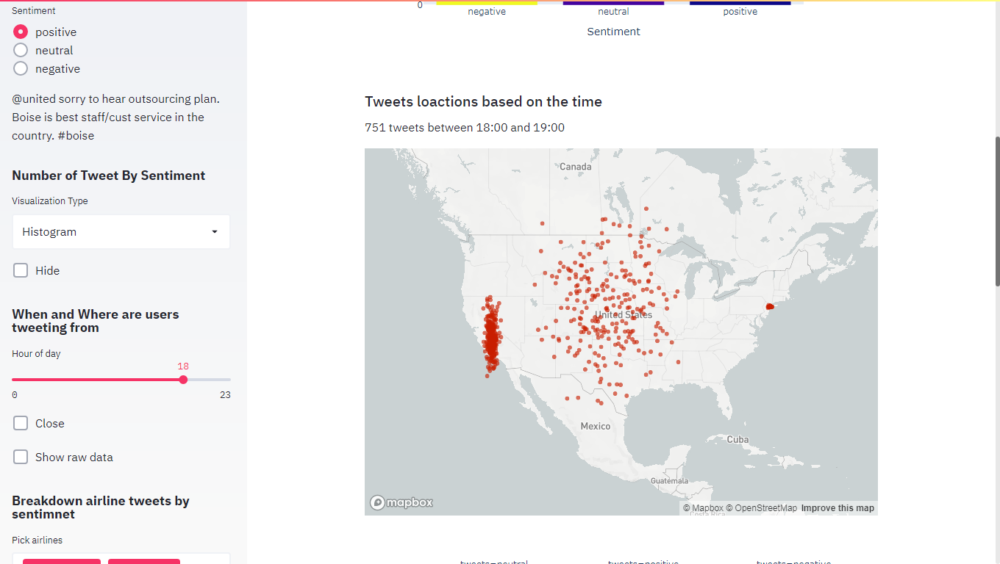
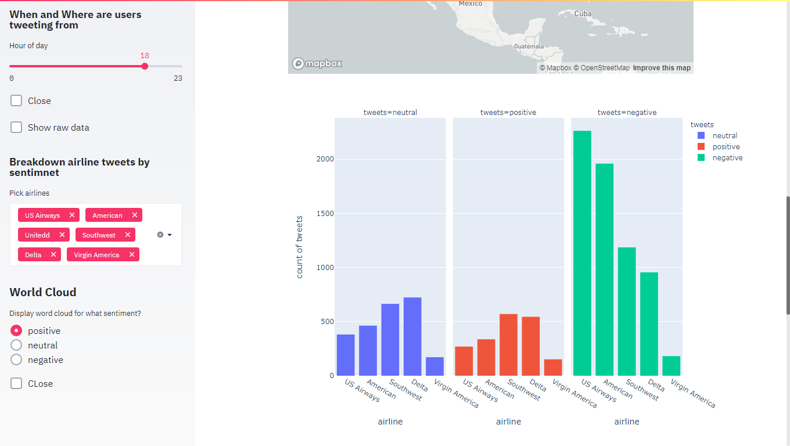
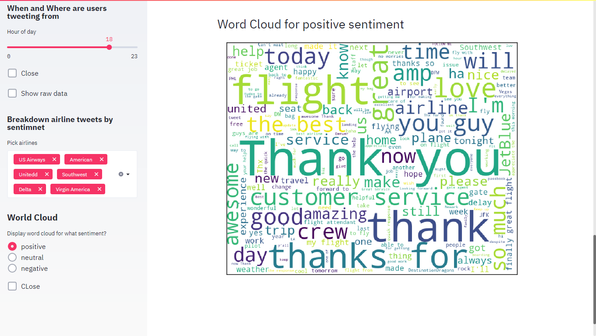

# *Web Dashboard For Sentiment Analysis* 






### Set up guide
> First Get the repository files Downloading or Clonning the repository
> Now open the folder using any ide or editor and select python. Now navigate to console and type
```bash
streamlit run app/app.py
```
> It will open in localhost server. Now you can use it easily.

### Customize Heading and Title of your Task
```python
t.title("Sentiment Analysis Tweets About US Airlines")
st.sidebar.title("Sentiment Analysis Tweets About US Airlines")
st.markdown(" This Application is a streamlit Dashboard to analyze Sentiment of Airlines Tweets in US 🐦")
st.sidebar.markdown(" This Application is a streamlit Dashboard to analyze Sentiment of Airlines Tweets in US 🐦")

```
Change the title,sidebar title,markdown and sidebar markdown according to your project.

### Environment 
Make sure you have all necessery python library installed. For this projects you need 
* Numpy
* Pandas
* Streamlit
* Plotly
* Matplotlib
* Scikit-learn
  
if you don't have these libraries go to python or anaconda prompt and paste these:
```bash
pip install numpy
pip install pandas
pip install streamlit
pip install plotly
pip install matplotlib
pip install sklearn
```


### Get touch with Me
Connect- [Linkedin](https://linkedin.com/in/rakibhhridoy) <br>
Website- [RakibHHridoy](https://rakibhhridoy.github.io)


